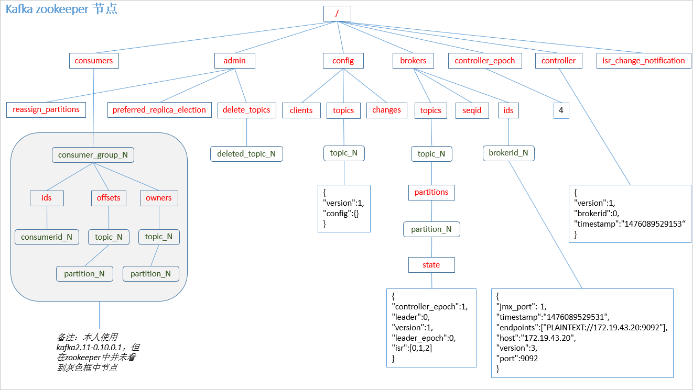
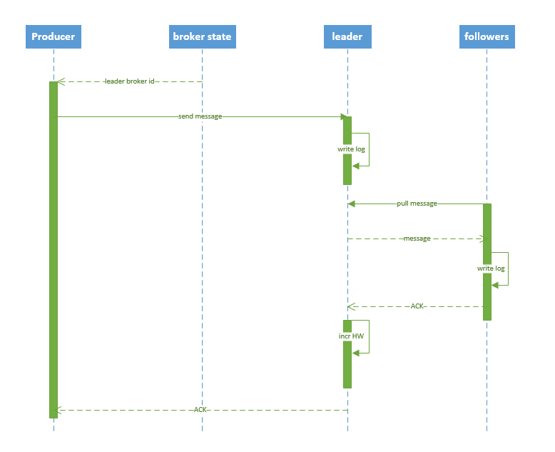

# 一.kafka原理图

# 二. kafka 在 zookeeper 中的存储结构如下图所示：

# 三.producer 写入消息序列图如下所示：

流程说明：
1. producer 先从 zookeeper 的 "/brokers/.../state" 节点找到该 partition 的 leader
2. producer 将消息发送给该 leader
3. leader 将消息写入本地 log
4. followers 从 leader pull 消息，写入本地 log 后 leader 发送 ACK
5. leader 收到所有 ISR 中的 replica 的 ACK 后，增加 HW（high watermark，最后 commit 的 offset） 并向 producer 发送 ACK