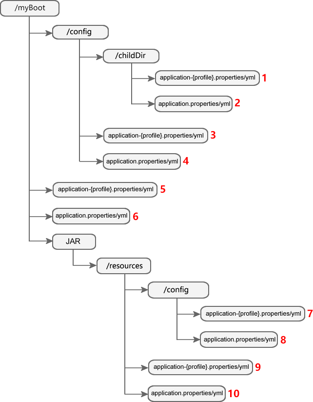

配置文件
Spring Boot 启动时，会自动加载 JAR 包内部及 JAR 包所在目录指定位置的配置文件（Properties 文件、YAML 文件），下图中展示了 Spring Boot 自动加载的配置文件的位置及其加载顺序，同一位置下，Properties 文件优先级高于 YAML 文件。

图 2 说明如下：
/myBoot：表示 JAR 包所在目录，目录名称自定义；
/childDir：表示 JAR 包所在目录下 config 目录的子目录，目录名自定义；
JAR：表示 Spring Boot 项目打包生成的 JAR；
其余带有“/”标识的目录的目录名称均不能修改。
红色数字：表示该配置文件的优先级，数字越小优先级越高。

这些配置文件得优先级顺序，遵循以下规则：
先加载 JAR 包外的配置文件，再加载 JAR 包内的配置文件；
先加载 config 目录内的配置文件，再加载 config 目录外的配置文件；
先加载 config 子目录下的配置文件，再加载 config 目录下的配置文件；
先加载 appliction-{profile}.properties/yml，再加载 application.properties/yml；
先加载 .properties 文件，再加载 .yml 文件。

